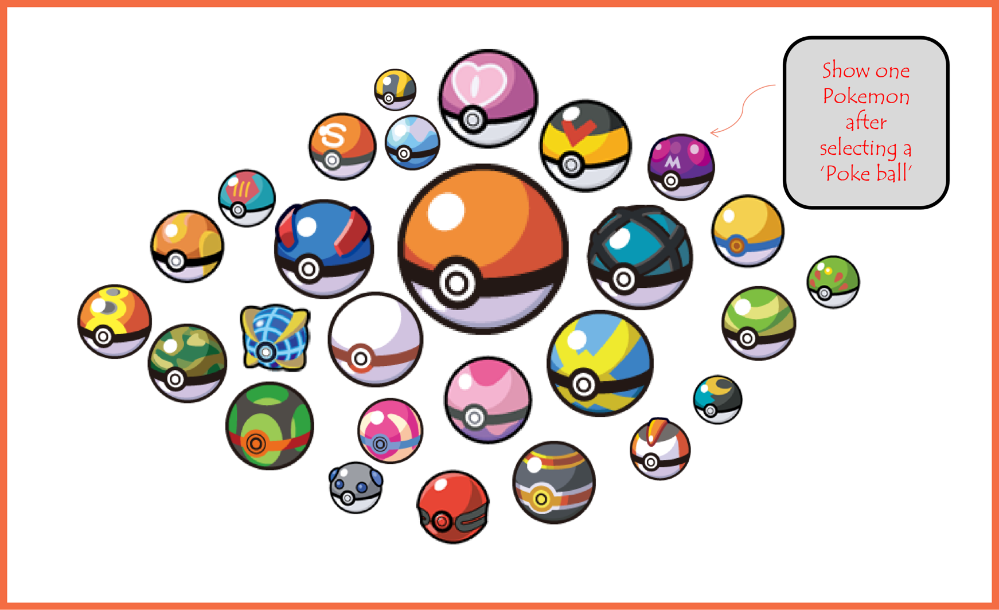
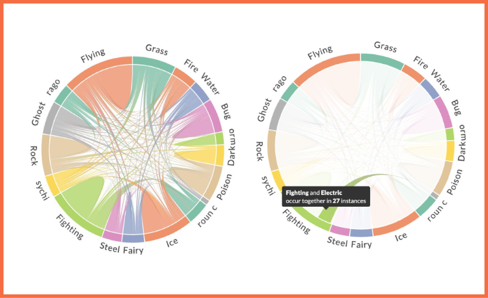
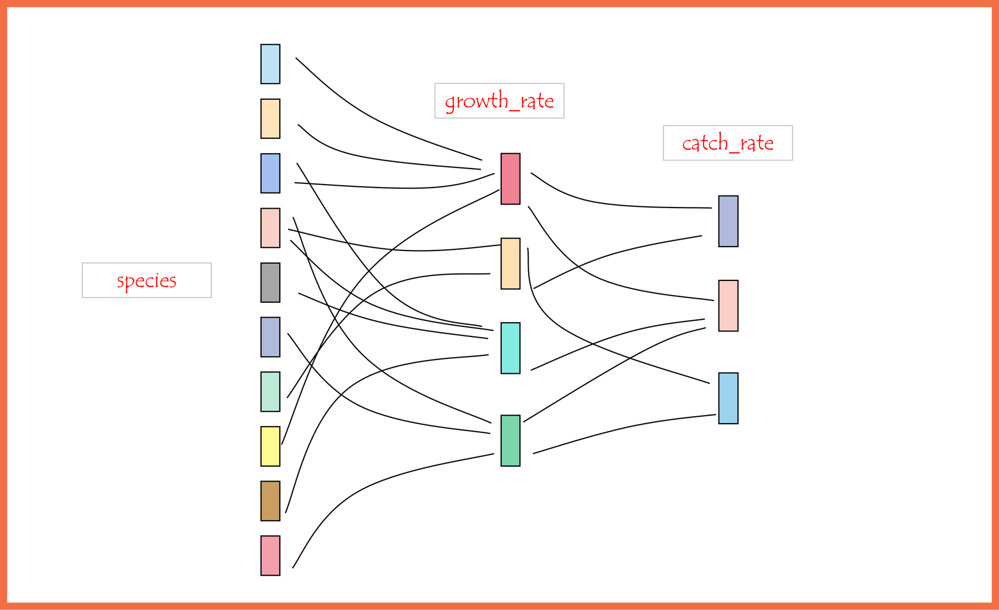
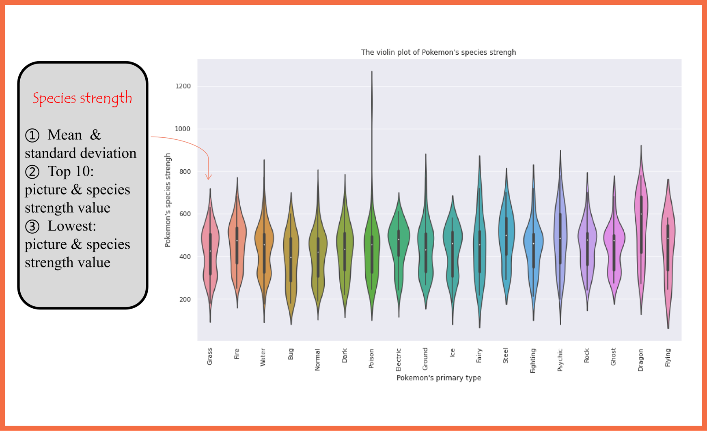
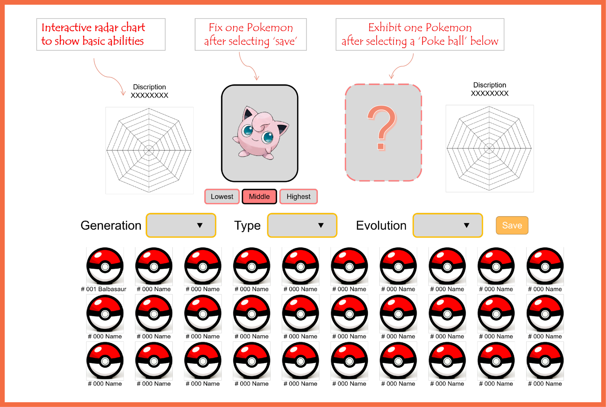

# Milestone 2

### Link  to our website: https://2v2of.csb.app/index.html

### Sketches of the visualizations

When it comes to Pokémon, you may have a broad outline of it from the games, the anime, the movies, and the trading cards, or are completely bewildered by the Pokémon mania that’s gripping the Internet right now. Regardless of which camp you are in, sit back, grab your beverage of choice, and relax—we are going to get a detailed look of Pokémons and choose your favorite pocket monsters. Our website will contain ideally five different visualizations. The first part is a bubble diagram, presented in the form of "Poke balls". Then, in the second part, we wanna use the chord diagram to get an overview of the mix-type Pokémons. The third part is a violin graph to show the species strength distribution. Finally, we wanna users to choose their favorite Pokémons by comparing their basic skills, abilities, and other relational characteristics.

#### Bubble diagram

The first part is a bubble diagram to show the frequency of Pokémon's type. Each bubble will be displayed as a "Poke Ball". When selected a Poke Ball, the user will see detailed information of a type of Pokémon, such as the name, typical abilities, appearance description, characteristics of different evolutionary status, and skills assessment. Uner this text description, a typical image of each type is following. Combining the words and pictures, users can use a fast, easy, and vivid way to open their own Poke Balls, and choose their preferred type.

#### Chord diagram

Other than just show one type of Pokémon, users may want to find a mix-type (combined type) of Pokémon. We use the chord map to help them, when their mouse stops on a chord such as a fight and lighting, there will be a representative Pokémon name, pictures, their abilities panel on the right help the rookie to get an overview of this mix-type, whether they like how it looks, or be happy with their attribute.

#### Sankey Diagram

On the Sankey diagram, we include three attributes: species, growth rate, and catch rate. We want users to know how the species differ in the growth rate. And find out whether the growth rate and species have a correlation with catch rate. They may find out which kind of species is easier to catch and faster in growing. We also consider adding the relation of catch rate and height/weight of Pokémon.

#### Violin Graph

Then we focus on the species strength, which is the sum of these six abilities. Species strength may be the most practical variable to Measure the strength of Pokémon. There is a saying among players, we reckon that this is a quite powerful Pokémon when the species strength value is more than 550. Here a 'Powerful' Pokémon means it's better than the majority of Pokémon.   

In this part, we use a violin graph to show the Pokémon's species strength. The y-label is the Pokémon's species strength, while the x-label is the primary type of Pokémon. We can see Dragon Pokémon tend to have the highest species strength among all the types. This is also the same as players' intuition.   

As for the interactive part, when the viewer puts his mouse on each violin, for example on the grass type's violin, it shows 1) the mean and standard deviation of grass Pokémon's species strength; 2) the top ten highest species strength Pokémon's picture and its species strength; and 3) the Pokémon with the lowest species strength and its species strength.

#### Radar Chart

Here, we give a visualization to compare different Pokémon and inspire you to choose your coveted Pokémon. In this section, you just need to input the Pokedex of Pokémon and then you can see two or three different Pokémon with their species strength, appearance, radar chart of 6 base abilities (HP, Attack, Defense, Special Attack, Special Defense, and Speed). Also, you can check thier Evolutions and appearance changes. Some attached information such as the Pokémon's generation and its discovered area can also be found here.   

After the comparasion and comprehensive consideration, you can draw a conclusion to find your own coveted Pokémon!

### List of the tools for each visualisation

There are five main interactive figures in our website, which are Bubble diagram, Chord diagram, Sankey diagram, Violin graph, Radar chart. As expected, we will use all lectures about HTML, CSS and, Javascript. The specific tools we used are as follows.

#### CodeSandbox

The website is hosted on **CodeSandbox**(https://codesandbox.io) pages. 

#### d3.js

Basically, our graphs require the use of `d3.js` library. Some visualizations are done with the help of `d3.js` gallery, like the Bubble diagram.

#### amcharts 4

Other visualizations such as the Chord Diagram and Sankey Diagram are done with `amcharts`, which is a library with an API providing us lots of ways to modify the charts however we want in simple ways.

#### Lecture and Tutorials

We are inspired by some examples introduced by lectures and exercises, such as interactive d3 (Lecture 5 and exercise 5), color marks, and channels (Lecture 6 and exercise 6). What's more, future lectures like graphs and tabular data, will be of great help for our selection and comparison part (the radar chart). And there possibly are other lectures that will inspire us to do further perfection.

### Break down of the goal

The main target of our website is to help either rookie, amateurs, or big fans of Pokémon to acquaint with Pokémon from different dimensions. First, we will use Poke Ball to display different types of Pokémon. Then the chord diagram will represent the relationship between different types, and the sankey diagram will exhibit the relationship between species, growth rate, and catch rate. Finally, users can choose their own favorite Pokémons by comparing the description information and 6 basic abilities exhibited by the radar chart.

#### Bubble diagram

This visualization is designed to attract users to select their own Poke Balls and explore the basic characteristics of each type. Opening the Poke Ball, users can have the first understanding of their abilities, main skills, characteristics of different evolutionary statuses, and macroscopic features. Selecting Pokémon through Poke Balls simulates the process of catching and storing Pokémon, which will let users feel Pokémon the world, and gain a better understanding of the legendary Pocket Monsters.

#### Chord diagram

After understanding the basic aspects of Pokémon, we want our users to go on exploring.There are plenty kinds of mix-type Pokémon that make up the wonderful Pokémon world. We use the chord map help them to get an overview of how a mix-type Pokémon looks like and their abilities.when they move their mouse they can see different kinds of representative Pokémon and their ability panel. Then they can decide whether they like this mix-type.

#### Sankey diagram

We want our rookie to find out that there are plenty attributes affect the Pokémon, they may chose some species or size that they like,while find out how they choice affect with the growth rate and catch rate.Some Pokémon may be easily caught but has slow growth rate. some big species may have fast growth rate but too hard to be found and caught.

#### Violin graph

This visualisation aims to help player to know Pokémon with high species strength. Each violin in our graph represents the data from the same type, such as Grass, Fire, Water and so on. More acurely, there will be a list of Pokémon with the top 10 highest species strength for each type. What's more, we will also give viewer the statistics data, for instance, the mean and stand standard deviation of Pokémon's species strength.   

This can help player have a more type-based general view of Pokémon, which helps player to narrow down their target range and find thier one and only coveted Pokémon.

#### Radar chart

This the final and themost important step to achieve our initial goal. To help players to compare and find thier coveted Pokémon. Here, our provide an interactive figure to have a specific view and several choosen Pokémon. Player can input the Pokedex of two Pokémon, and our website will give a detialed and beautiful list in order to Compare specific features like hp, defense, species strengh and its abilities(A list of abilities that the Pokémon is capable of having).

Hopefully, after this part, the player can have a deep understanding of these Pokémon and find their coveted one.

#### Extra ideas

We hope to help the player to choose a group of Pokémon (Generally, the international  Pokemon Compitation needs 6 Pokémon), considering the Pokémon attribute restraint table.