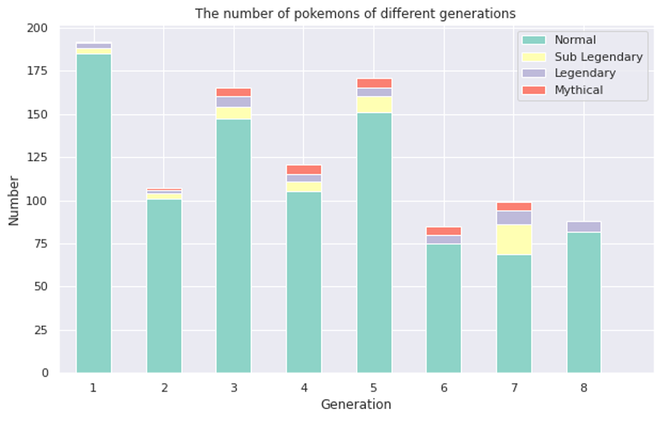
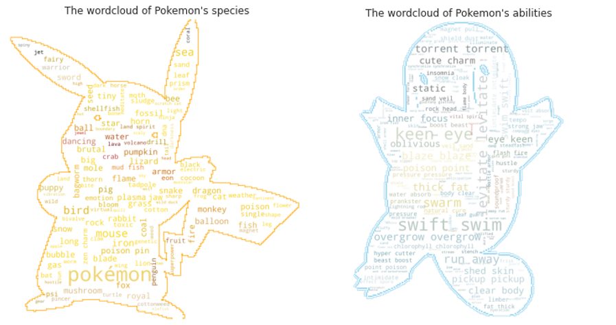
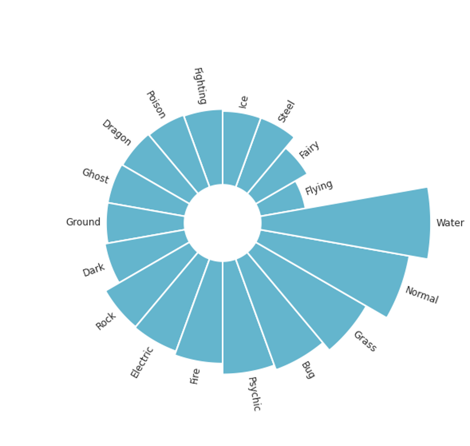
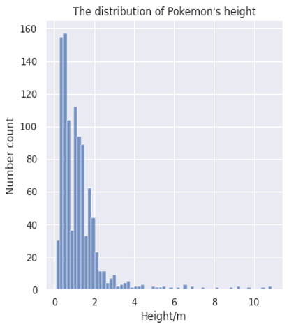
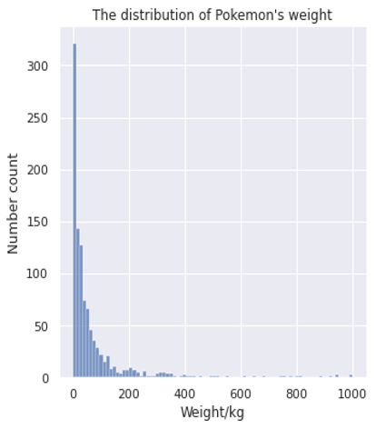

# Project of Data Visualization (COM-480)

| Student's name | SCIPER |
| -------------- | ------ |
| Chenkai Wang | 323452 |
| Jingrong Chen | 313033 |
| Siran Li | 321825 |

[Milestone 1](#milestone-1) • [Milestone 2](#milestone-2) • [Milestone 3](#milestone-3)

## Milestone 1 (23rd April, 5pm)

**10% of the final grade**

This is a preliminary milestone to let you set up goals for your final project and assess the feasibility of your ideas.
Please, fill the following sections about your project.

*(max. 2000 characters per section)*

### Dataset

[Pokémon](https://en.wikipedia.org/wiki/Pok%C3%A9mon) shortened from Pocket Monster, is any of the documented species of the organisms that have evolved and inhabited the fictional “Pokémon World” with an innate connection to element-based supernatural powers. Officially, Pokémon is a Japanese media franchise managed by The Pokémon Company, a company founded by Nintendo, Game Freak, and Creatures. This year is in commemoration of the twenty-fifth anniversary of the Pokémon franchise, which began with the original Japanese release of [Pocket Monsters Red and Green](https://en.wikipedia.org/wiki/Pok%C3%A9mon_Red_and_Green) for the Game Boy on February 27, 1996. 

In the first part of the Pokémon Series, [Ash Ketchum](https://en.wikipedia.org/wiki/Ash_Ketchum) is allowed to start his journey in the world of Pokémon and dreams of becoming a Pokémon master. The same as Ash, many of us dream to become the Pokémon master! Based on the topic “How to become a Pokémon master”, we gain our dataset and try to figure out a modern way to analyze our  Pokémon.

We get our dataset from Kaggle, and its original resource is from https://serebii.net, which is the most famous online Pokémon website. The dataset consists of 50 columns and there are 890 Pokémon from generation 1 to 8. After neglecting trivial variables, variables related to our project are shown below. 

\- **Pokedex_number**: The ID number of documented Pokémon in the National Pokedex

\- **Name**: The English name of the Pokémon

\- **Generation**: The numbered generation which the Pokémon was first introduced

\- **Status**: The status of the Pokémon (A categorical feature contains: normal, sub-legendary, legendary, mythical)

\- **Species**: The species of the Pokémon

\- **Hp/ Attack/ Defense/ Sp_attack/ Sp_defense/ Speed**: The Base HP/ Attack/ Defense/ Special Attack/ Special Defense/ Speed value of the Pokémon

\- **Height_m/ Weight_kg**: The Height/ Weight of the Pokémon

\- **Against_?**: Eighteen features that denote the relationship of damages taken against an attack of a particular type

\- **Abilities**: A stringified list of abilities that the Pokémon is capable of having

\- **type_1/ tpye_2**: The Primary/ Secondary type of the Pokémon

\- **Percentage_male**: The percentage of the species that are male. Nan if the Pokémon is genderless

To assess the dataset, the dataset is quite accurate and relatively clear. There are not too many pre-processing works before our official visualization. So we put our emphasis on the following parts.

### Problematic

The era of data refreshes the way people explore the unknown, from basic construction to aerospace engineering. Prof Oak from Pallet Town keeps searching and helping Pokémon Trainer to train their Pokémon. He invented Pokédex to show basic instructions and simple analysis of Pokémon, including Pokémon’s height, weight, characteristics, etc. But

We, as Pokémon trainers,  always dream to be Pokémon Masters since we were children. So just analyzing the data of a single Pokémon is far from satisfying my needs.

Now as the Pokémon data scientists in Pallet Town, we want to help our children and rookies to explore the Pokémon world easily. We would like to give them some advice on how to choose their Pokémon. We want an elegant way to show them Pokémon’s characteristics and capabilities by using interactive graphs and tables instead of numbers.

Therefore we think about multiple views we would like to cover.

* Which Pokémon suits them best? 

* And which Pokémon are ahead of the game in the battle?

* How to choose a good team from thousands of Pokémon?

* To capture our own Pokémon, which one is easier to tame?

* How to present their characters and stories in good ways?

* What kind of Pokémon will restrain each other?   

 ……

We have 1028 Pokémon and each of them has 48 different characters. There are a lot of mysteries about them waiting for us to discover.

### Exploratory Data Analysis

***\*Let’s take a quick look at Pokémon first!\****

We counted the number of Pokémon of different generations and the number of different statuses corresponding to each generation. The first generation is the largest, but it has no mythical status. If we want to find the mythical Pokémon, we have a better chance in the third to the seventh generation. Compared with other generations, the number of Pokémon in the seventh generation is not larger, but we have the highest chance to get the non-normal status of Pokémon. 

What words are most common in Pokémon’s species and abilities?

Pokémon comes in a wide variety of species and abilities. These lively and vigorous elves formed a new fantastic and compelling world, which attracts us to continuously explore.

**Then, let us focus on the distribution of the primary type of Pokémon.**

From the above figure, we can see that the “Water” type of Pokémon has the most types, followed by the “Normal” type and “Grass” type, th the “Flying” type is the least kind of Pokémon.

**How tall and how heavy are Pokémons?**

|  |  |
| ------------------------------------------- | ------------------------------------------- |
|                                             |                                             |

From the above figures, we can know that most Pokémon are 0.2~2m tall and weigh 0~50kg.  More than 300 Pokémon are between 0.4~0.8m and less than 15kg. Statistically, most of them are very small, like Shiba or sheep. Few of them are very big or heavy, and the highest is 100m, the two heaviest are 999.9kg. Conversely, the shortest Pokémons are 0.1m, and the lightest are 0.1kg. In order to show the figure more clearly, we omitted three Pokémons, ('Eternatus Eternamax','Eternatus' and 'Wailord').

### Related work

##### What others have already done with the data?

These previous works mainly focus on presenting Pokémon's characteristics about Base Stats, power, type, E.t.c.  However, they use a static way of presenting data.

[Serebii](https://serebii.net/attackdex-rby/): Presenting Pokémon's stats and their looks, it provided a low-level interactive way by clicking and presenting all the statics.

[Pokémon data visualization](https://www.kaggle.com/lakshyaag/data-visualization-pokemon-data): this data visualization notebook presents some basic graphs and interactive visualizations, some of the interactive graphs are beautiful in telling a story.

##### Why is our approach original?

We want to offer an interactive way to visualize our data, our visualizations will show detailed statistics while not messy, we want our visualizations to be as cute as possible since Pokémon are the cutest creatures in the anime world, in this way, adults, teenagers even children would have no pressure reading our story, anyone who knows the Pokémon for the first time could have an overwhelming experience in getting started on Pokémon world. We hope to extract more interesting insights and get a better understanding of our Pokémon.

##### To conduct the visualization work, our Inspiration mainly comes from:

[Anime Data visualization](https://com-480-data-visualization.github.io/com-480-project-worldwideweebz/#/chord): the chord diagram looks stunning when presenting related attributes. We are inspired by this beautiful work, then we decide to present our Pokémon types by using this kind of interactive way. We can get an overview of the multi-type Pokémon’s numbers.

 

[Pokémon team planner](https://richi3f.github.io/pokemon-team-planner/national_dex.html#charmander+charizard-mega-x+rattata-alola+clefable+venonat+dugtrio-alola): this interactive Pokémon team planner provides a colorful and interesting way to choose your own team, but it only has the picture and type of Pokémon you chose and shows no ability and status.

## Milestone 2 (7th May, 5pm)

**10% of the final grade**

## Milestone 3 (4th June, 5pm)

**80% of the final grade**

## Late policy

- < 24h: 80% of the grade for the milestone
- < 48h: 70% of the grade for the milestone

